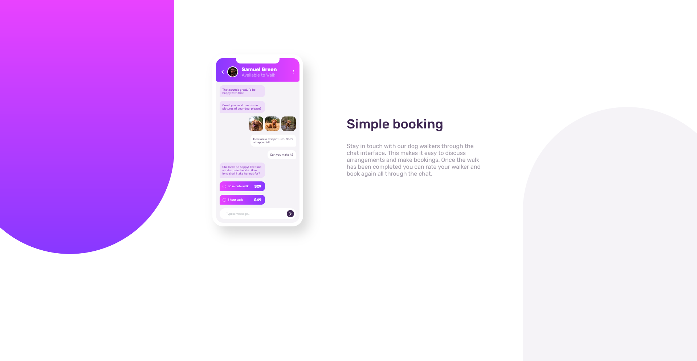
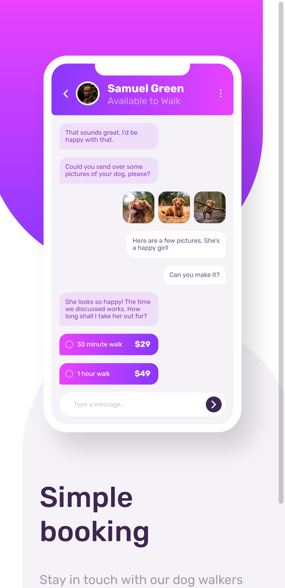

# Frontend Mentor - Chat app CSS illustration solution

This is a solution to the [Chat app CSS illustration challenge on Frontend Mentor](https://www.frontendmentor.io/challenges/chat-app-css-illustration-O5auMkFqY). Frontend Mentor challenges help you improve your coding skills by building realistic projects. 

## Table of contents

- [Overview](#overview)
  - [The challenge](#the-challenge)
  - [Screenshot](#screenshot)
  - [Links](#links)
- [My process](#my-process)
  - [Built with](#built-with)
  - [What I learned](#what-i-learned)
  - [Continued development](#continued-development)
  - [Useful resources](#useful-resources)
- [Author](#author)
- [Acknowledgments](#acknowledgments)

**Note: Delete this note and update the table of contents based on what sections you keep.**

## Overview

### The challenge

Users should be able to:

- View the optimal layout for the component depending on their device's screen size
- **Bonus**: See the chat interface animate on the initial load

### Screenshot




### Links

- Solution URL: [github.com/thesohailjafri/Chat-app-css-illustration](https://github.com/thesohailjafri/Chat-app-css-illustration)
- Live Site URL: [fm-chat-app-css-illustration.netlify.app](https://fm-chat-app-css-illustration.netlify.app/)

## My process

I started by creating and aligning background color blocks then i create chat app block using nested combination of divs and spans and then the Intro section and aligned Mobile and intro using css grid-template-column.

### Built with

- Semantic HTML5 markup
- SCSS custom properties
- Flexbox
- CSS Grid
- Desktop-first workflow


### What I learned

How to use Grid-template Columns and Rows.

To see how you can add code snippets, see below:

```css
main {
     display: grid;
    grid-template-columns: [a] 250px [b] auto;
    column-gap: 120px;
}
```


### Useful resources

- [Grid Flow and Basics](https://css-tricks.com/snippets/css/complete-guide-grid/) - helped to understand grid flow.


## Author

- Website - [Sohail Jafri](https://www.thesohailjafri..netlify.app)
- Frontend Mentor - [@thesohailjafri](https://www.frontendmentor.io/profile/thesohailjafri)

